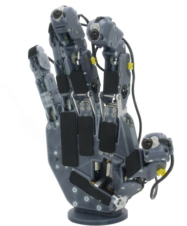
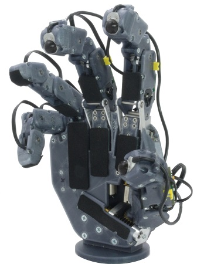

# PUT-Hand-MechanicalDesign

## About

PUT-Hand is an open-source project of a 5-finger anhomomorphic gripper. PUT-Hand is designed to manipulate wide range of object including elastic objects. PUT-Hand was designed using as many off-the-shelf parts and FDM 3D printing technology, with single elements requiring aluminium CNC machining or stainless steel turning. The [PUT-Hand repositories](https://github.com/puthand) include all parts necessary to recreate the proposed design: mechanical files, PCB design and firmware.

PUT-Hand-MechanicalDesign repository contains all detailed mechanical design files for PUT-Hand anhomomorphic gripper project, together with proper assembly files. Files can be opened using Autodesk Inventor software, minimum required version: 2017. Main assembly file: [./PUT-Hand.iam](./PUT-Hand.iam)

 


## Tools

* Autodesk Inventor min. 2017 - <https://www.autodesk.com/products/inventor/overview>

## License

<a rel="license" href="http://creativecommons.org/licenses/by-nc/4.0/"></a>

Unless stated otherwise, PUT-Hand project elements are licensed under a [Creative Commons Attribution-NonCommercial 4.0 International](https://creativecommons.org/licenses/by-nc/4.0/) (CC BY-NC 4.0). Accompanying firmware and software are licensed under a [MIT License](https://opensource.org/licenses/MIT).

When using PUT-Hand design files, firmware, software, or utilising project as a whole please cite the following article: **PUT-Hand—Hybrid Industrial and Biomimetic Gripper for Elastic Object Manipulation**

```plaintext
Mańkowski, T.; Tomczyński, J.; Walas, K.; Belter, D. PUT-Hand—Hybrid Industrial and Biomimetic Gripper for Elastic Object Manipulation. Electronics 2020, 9, 1147. 

@article{putHandMankowski2020,
   author = {Mańkowski, Tomasz and Tomczyński, Jakub and Walas, Krzysztof and Belter, Dominik},
   title = {PUT-Hand—Hybrid Industrial and Biomimetic Gripper for Elastic Object Manipulation},
   journal = {Electronics},
   volume = {9},
   year = {2020},
   number = {7},
   article-number = {1147},
   url = {https://www.mdpi.com/2079-9292/9/7/1147},
   issn = {2079-9292},
   doi = {10.3390/electronics9071147}
}
```
